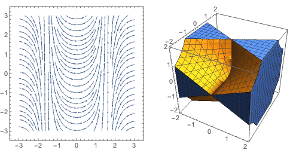
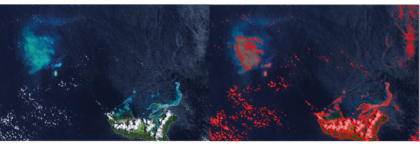

# The ***mmapy*** Package Documentation

The ***mmapy*** package is designed to bring interoperability between *Python* (*IPython*/*Jupyter*) and *Wolfram Mathematica*.

## Introduction


## Features


## Demonstration

### Importing ***mmapy***

As long as ***mmapy*** is properly deployed in *Python*'s "site-packages" directory, import can be done with the following line.

```python
import mmapy
```

To further simplify the workflow, map ***mmapy*** to single-character variables, e.g.

```python
import mmapy as M
```

### Using ***mmapy*** to call *Mathematica* evaluations

```python
M.[Variation]( 'Some Mathematica Command' )
```

As of the current stage of development, 5 variations of ***mmapy*** functions can be called to launch a *Mathematica* kernel to evaluate a given (set of) expression(s). While all functions trigger similar evaluation sequences, different output processing procedures are incurred. The following table demonstrates the usage scenario and output format of each variation.

| Variation |                 Scenario                 |               Output                |
| :-------: | :--------------------------------------: | :---------------------------------: |
|  ***n***  | When expecting raw *Mathematica* output in plain text |    String (Plain/*Mathematica*)     |
|  ***t***  | When expecting *TeX*-form output in plain text |           String (*TeX*)            |
| ***td***  | When expecting *TeX*-form output compiled and displayed | *IPython.core.display.Math* object  |
|  ***p***  | When expecting *Python*/*numpy*/*sympy* expressions as output |         *Python* expression         |
|  ***g***  |      When expecting graphics output      | *IPython.core.display.Image* object |

#### ***mmapy.n()*** -- Producing unconverted *Mathematica* output in plain text

When the expression returned from *Mathematica* is originally a string, or when *sympy.parsing* is not able to guarantee correct conversions, the ***n*** variation should be chosen to produce a raw *Mathematica* output, which can be picked up and recycled by a custom parser. e.g.

```python
M.n( 'StringTake["The Ultimate Answer", {5, 12}]' )
```

> 'Ultimate'

#### ***mmapy.t()*** -- Producing *TeX*-form output in plain text 

*Mathematica* provides the option to format an expression in *TeX* while converting it into a string. Only use this option when the output's content and structure can be well represented by *TeX* expressions (e.g. math/symbolic expressions, tables, matrices). Further string operations can then be called to manipulate the output.

```python
M.t( 'Integrate[1/(x^3 + 1), x]' )
```

> '-\\frac{1}{6} \\log \\left(x^2-x+1\\right)+\\frac{1}{3} \\log (x+1)+\\frac{\\tan ^{-1}\\left(\\frac{2 x-1}{\\sqrt{3}}\\right)}{\\sqrt{3}}'

#### ***mmapy.td()*** -- Displaying *TeX*-form output 

The ***td*** variation puts a wrapper outside ***t*** and utilizes the *IPython.display* module to compile and render reader-friendly output. This option is more preferable in interactive and exploratory contexts than in automated pipelines. 

```python
M.td( 'Integrate[1/(x^3 + 1), x]' )
```

> 

#### ***mmapy.p()*** -- Producing *Python*-compatible expressions as output

It is sometimes a preferable option to integrate ***mmapy*** into a *Python* scientific computing workflow. The ***p*** variation converts *Mathematica* output into *Python* expressions by calling *mathematica* in the *sympy.parsing* module to complete the parsing and conversion process.

A standalone example:

```python
M.p( 'M.p( '{a, b, c}.{x, y, z}' )' )
```

> a\*x + b\*y + c\*z

As integrated:

```python
# Determine how many 15-USD-Bagels you can buy with a 100-EUR note.

def currency(list):
	return "".join(['QuantityMagnitude@CurrencyConvert[Quantity[', str(list[0]), ',', '"', list[1], '"', '],', '"', list[2], '"',']'])

inboundData = ('100', 'Euros', 'USDollars')

cmd = currency(inboundData)
conv = M.p(cmd)

print('You can buy', int(conv) // 15, "bagels!")
```

> You can buy 7 bagels!

#### ***mmapy.g()*** -- Producing graphics output

In compliance with the need for data visualization and graphical operations, the ***g*** variation is developed to channel graphics output from the *Mathematica* kernel to the *IPython*/*Jupyter* frontend. Take special note that *Mathematica* is designed to have its frontend handle all rendering operations, thus **a working display must be available at the remote machine**. A few examples are given below to illustrate the use of ***mmapy.g*** in various scenarios.

2-D and 3-D plotting:

```python
# Create a 2-D stream plot and a 3-D region plot
D2Plot = 'StreamPlot[{Cos[x], Tan[x]}, {x, -3, 3}, {y, -3, 3}]'
D3Plot = 'RegionPlot3D[x^2 - y^2*z^2 > 0, {x, -2, 2}, {y, -2, 2}, {z, -2, 2}]'

M.g( 'GraphicsRow[{' + D2Plot + ',' + D3Plot + '}, ImageSize -> {Automatic, 300}]' )
```

> 

Image processing/preparation:

```python
imgPath = 'documentation-images/landsat.jpg'
cmdImport = 'img = Rasterize[Import[' + imgPath + '], ImageSize -> 1000];'
cmdMesh = 'mesh = ImageMesh[img];'
comdComp = []

```

> 

## Methodology


## Limitation


## Notes on Further Development


## License